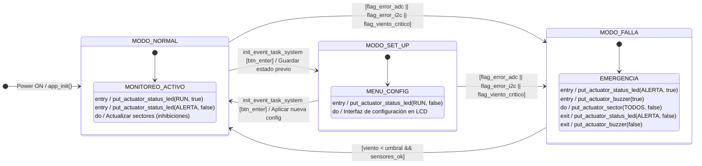

**TA134 – Taller de Sistemas Embebidos**

# Memoria del Trabajo Final: Sistema de Riego Automático con Gestión de Viento (SRAGV)

Sistema de riego inteligente por aspersión con inhibición de sectores en función del viento.

## Autores

| **Apellido, Nombre**      | **Padrón** |
| ------------------------- | ---------- |
| Garcia Caneva, Leandro    | 103476     |
| Vargas, Joaquin           | 104323     |
| Molina Aban, Florencia    | 104153     |

**Docente:** Cruz, Juan Manuel  
**Tutor:** Lutenberg, Ariel  
**Fecha:** 1er cuatrimestre 2026  
**Curso-Grupo:** 1-04

*Trabajo realizado en la Ciudad Autónoma de Buenos Aires.*

---

# Índice General

- [Capítulo 1: Introducción general](#capítulo-1-introducción-general)
  - [1.1 Análisis de necesidad y objetivo](#11-análisis-de-necesidad-y-objetivo)
  - [1.2 Productos comparables](#12-productos-comparables)
  - [1.3 Productos comerciales disponibles](#13-productos-comerciales-disponibles)
  - [1.4 Comparación con el prototipo desarrollado y alcance](#14-comparación-con-el-prototipo-desarrollado-y-alcance)
- [Capítulo 2: Introducción específica](#capítulo-2-introducción-específica)
  - [2.1 Requisitos del sistema](#21-requisitos-del-sistema)
  - [2.2 Casos de uso](#22-casos-de-uso)
  - [2.3 Descripción de módulos y tecnologías utilizadas](#23-descripción-de-módulos-y-tecnologías-utilizadas)
- [Capítulo 3: Diseño e implementación](#capítulo-3-diseño-e-implementación)
  - [3.1 Arquitectura de Hardware](#31-arquitectura-de-hardware)
  - [3.2 Diseño de Firmware (Máquinas de Estado)](#32-diseño-de-firmware-máquinas-de-estado)
  - [3.3 Esquema Eléctrico y Vistas de Cableado](#33-esquema-eléctrico-y-vistas-de-cableado)
  - [3.4 Aplicación Web](#34-aplicación-web)
- [Capítulo 4: Ensayos y resultados](#capítulo-4-ensayos-y-resultados)
  - [4.1 Pruebas de integración Hardware-Software](#41-pruebas-de-integración-hardware-software)
  - [4.2 Pruebas de campo simuladas](#42-pruebas-de-campo-simuladas)
- [Capítulo 5: Conclusiones](#capítulo-5-conclusiones)
- [Capítulo 6: Uso de herramientas de inteligencia artificial](#capítulo-6-uso-de-herramientas-de-inteligencia-artificial)
- [Capítulo 7: Bibliografía y referencias](#capítulo-7-bibliografía-y-referencias)

---

## Capítulo 1: Introducción general

### 1.1 Análisis de necesidad y objetivo

El objetivo de este proyecto fue desarrollar un sistema de riego automático inteligente gestionado por viento. Si bien el riego automatizado es fundamental para optimizar el uso del agua y garantizar una cobertura uniforme, factores climáticos extremos pueden alterar drásticamente su eficacia. Esta problemática cobra especial relevancia en regiones como la Patagonia argentina, donde la presencia de vientos fuertes y sostenidos —con ráfagas que superan frecuentemente los 80 km/h— es una constante, desviando el agua de su objetivo y generando desperdicio. Además, el impacto continuo del agua contra estructuras cercanas (como calzadas, galpones o paredes) puede deteriorarlas gravemente con el tiempo.

El sistema SRAGV (Sistema de Riego Automático Gestionado por Viento) resuelve este problema inhibiendo sectores específicos de riego en función de la velocidad y dirección del viento. Cabe destacar que, para el desarrollo de este prototipo, *el viento se emuló mediante un joystick analógico*, el cual simula tanto la velocidad (mediante la desviación desde el centro) como la dirección (mediante el eje dominante).

El sistema opera bajo un *Modo Normal* que puede funcionar con dos lógicas distintas de inhibición:

1. *Inhibición directa:* si hay viento en una dirección, se apaga el sector correspondiente a esa dirección. Por ejemplo, si hay viento Sur, se apaga el sector Sur. Esta opción está pensada para evitar que el viento empuje el agua hacia alguna construcción u objeto cercano al sector.
2. *Inhibición inversa (contrasector):* si hay viento en una dirección, se apaga el sector contrario. Por ejemplo, si hay viento Sur, se apaga el sector Norte, para compensar el arrastre del agua hacia ese sector.

### 1.2 Productos comparables

Existen en el mercado soluciones de riego automatizado muy populares. Un ejemplo representativo disponible en Mercado Libre es el [*Programador de Riego Rain Bird Automático 4 Zonas*](https://www.mercadolibre.com.ar/programador-de-riego-rain-bird-automatico-4-zonas-blanco/p/MLA37257397) [1].

Si bien este equipo es robusto y comercialmente exitoso, carece de una característica central del presente diseño: no cuenta con un sistema que inhiba sectores específicos en función de la dirección del viento. Algunos programadores comerciales pueden conectarse a estaciones meteorológicas para suspender completamente el riego en caso de tormentas, pero no ofrecen la granularidad de apagar selectivamente zonas individuales basándose en la dinámica vectorial del viento en tiempo real. En esta etapa del producto, se priorizó la corrección por viento sobre otras variables, como la humedad de suelo, que suele estar presente en soluciones más completas.

### 1.3 Productos comerciales disponibles

El referente comercial principal para comparar este desarrollo es la familia de controladores de la empresa [Rain Bird](https://www.rainbird.com/es) [2], específicamente el modelo *Rainbird ESP-Rzxe*. Estos sistemas controlan electroválvulas mediante salidas de 24 VAC y permiten programación por días y zonas.

### 1.4 Comparación con el prototipo desarrollado y alcance

A diferencia del *Rainbird ESP-Rzxe*, el prototipo desarrollado incorpora lógica ambiental directa en la toma de decisiones por sector, considerando velocidad y dirección del viento en tiempo real, y no solo un temporizador fijo. Se implementaron dos lógicas de inhibición configurables: la *inhibición directa* (se inhibe el sector en la dirección del viento) y la *inhibición inversa* o *contrasector* (se inhibe el sector opuesto, para compensar el arrastre del agua). Esta doble modalidad permite adaptar el comportamiento del sistema a diferentes configuraciones de terreno y a la presencia de construcciones adyacentes a los sectores de riego.

---

## Capítulo 2: Introducción específica

En esta sección se presentan los requisitos del sistema, los casos de uso identificados durante la etapa de diseño y la descripción de los módulos y tecnologías utilizadas en el prototipo.

### 2.1 Requisitos del sistema

A lo largo del ciclo de vida del proyecto, los requisitos funcionales experimentaron una evolución. Durante la etapa de planificación, se plantearon las funcionalidades base que debía cumplir el prototipo para garantizar un control de riego eficiente y adaptable al viento. La Tabla 2.1 detalla esta primera aproximación de los requisitos.

| **Grupo** | **ID** | **Descripción** |
| :--- | :---: | :--- |
| **Sensores analógicos** | **RQ01** | El sistema contará con un joystick analógico para emular la velocidad y dirección del viento, conectado al ADC del microcontrolador. |
| | **RQ02** | El sistema contará con una fotocélula (LDR) para determinar la condición de luz diurna o nocturna. |
| **Actuadores** | **RQ03** | El sistema controlará 4 LEDs representando sectores de riego (Norte, Sur, Este, Oeste), inhibiendo los afectados por el viento. |
| **Modos de operación** | **RQ04** | El sistema operará en tres modos: NORMAL (monitoreo y riego), SET_UP (configuración) y FALLA (emergencia por viento crítico). |
| **Comunicación** | **RQ05** | La configuración y el monitoreo podrán realizarse de forma remota mediante un módulo Bluetooth. |
| **Almacenamiento** | **RQ06** | La configuración del usuario (umbrales de viento, sectores habilitados) se almacenará en una EEPROM externa con respaldo ante cortes de energía. |

<em>Tabla 2.1: Requisitos funcionales preliminares (fase de ideación).</em>

Posteriormente, conforme avanzó el desarrollo del firmware y la selección de la arquitectura de hardware, los requerimientos iniciales se desglosaron y refinaron para cubrir todos los aspectos operativos del sistema. La Tabla 2.2 presenta la versión definitiva de los requisitos implementados.

| **Grupo** | **ID** | **Descripción** |
| :--- | :---: | :--- |
| **Sensores analógicos** | **1.1** | El sistema contará con un joystick analógico para emular velocidad y dirección del viento, conectado a dos canales ADC del STM32. |
| | **1.2** | El eje X del joystick representará la velocidad del viento; el eje Y representará la dirección dominante (Norte, Sur, Este u Oeste). |
| | **1.3** | El sistema contará con una fotocélula (LDR) conectada a un canal ADC para medir la luminosidad ambiente. |
| | **1.4** | Las lecturas de los canales ADC se realizarán mediante DMA con *callback* de conversión completa, sin *polling* bloqueante. |
| | **1.5** | Se aplicará un filtro de promediado simple sobre las lecturas de velocidad de viento para reducir el efecto del ruido eléctrico. |
| **Actuadores — LEDs de sector** | **2.1** | El sistema contará con 4 LEDs que representan los sectores de riego: Norte, Sur, Este y Oeste. |
| | **2.2** | Con viento bajo o nulo, se activarán todos los sectores habilitados por el usuario. |
| | **2.3** | Con viento moderado, se aplicará la lógica de inhibición configurada (directa o contrasector). |
| | **2.4** | Con viento crítico (Modo FALLA), todos los LEDs de sector se apagarán. |
| | **2.5** | Cada LED de sector permanecerá encendido durante el tiempo de riego configurado, de forma no bloqueante. |
| **Indicadores de estado** | **3.1** | El sistema contará con al menos 2 LEDs de estado: uno verde (sistema activo) y uno rojo (falla). |
| | **3.2** | Durante el Modo FALLA, el LED rojo parpadeará a 1 Hz de forma no bloqueante. |
| | **3.3** | El sistema contará con un buzzer que se activará como señal sonora de alerta durante el Modo FALLA. |
| | **3.4** | El sistema contará con un display LCD 16×2 con interfaz paralela en modo 4 bits para mostrar el estado actual, lecturas de sensores y menús de configuración. |
| **Modos de operación** | **4.1** | El sistema operará en tres modos: NORMAL, SET_UP y FALLA, implementados mediante máquinas de estado. |
| | **4.2** | En Modo NORMAL, el sistema monitoreará los sensores y activará los LEDs de sector según los umbrales configurados y la condición de luz. |
| | **4.3** | En Modo NORMAL, si la LDR indica noche, el sistema podrá inhibir el riego si el usuario configuró la opción de solo riego diurno. |
| | **4.4** | En Modo SET_UP, el sistema suspenderá el riego automático y presentará el menú de configuración en el LCD. |
| | **4.5** | En Modo FALLA, el sistema inhibirá todos los sectores, activará el LED rojo y el buzzer, y mostrará el motivo de la falla en el LCD. |
| | **4.6** | El sistema iniciará siempre en Modo NORMAL con todos los LEDs de sector apagados. |
| **Menú interactivo** | **5.1** | El sistema contará con botones para navegar el menú, con antirrebote implementado por software de forma no bloqueante. |
| | **5.2** | El sistema contará con un conjunto de DIP *switches* para la habilitación o deshabilitación manual de sectores. |
| | **5.3** | El menú permitirá configurar: umbral de viento moderado, umbral de viento crítico, duración del ciclo de riego y habilitación de sectores. |
| | **5.4** | El menú mostrará en el LCD las lecturas actuales de velocidad de viento (en porcentaje) y el nivel de luz ambiente. |
| **Comunicación Bluetooth** | **6.1** | El sistema se comunicará con el módulo HM-10 a través de UART, con un protocolo de comandos ASCII simple. |
| | **6.2** | La aplicación Bluetooth permitirá visualizar el estado de cada sector, el nivel de viento y el nivel de luz en tiempo real. |
| | **6.3** | La aplicación Bluetooth permitirá configurar los umbrales de viento y la duración del riego de forma remota. |
| | **6.4** | La aplicación Bluetooth permitirá activar o desactivar manualmente un sector de riego. |
| **Almacenamiento EEPROM** | **7.1** | El sistema almacenará la configuración del usuario en una EEPROM externa AT24C02 vía I²C. |
| | **7.2** | Al iniciar, el sistema leerá la configuración almacenada en EEPROM y validará su integridad mediante un *checksum*. |
| | **7.3** | Si la EEPROM no contiene configuración válida, el sistema cargará valores por defecto y los escribirá en EEPROM. |
| ***Soft* RTC** | **8.1** | El sistema llevará un contador de *ticks* de 1 ms basado en el SysTick del STM32, utilizado como referencia de tiempo para el riego y los temporizadores. |
| **Bajo consumo** | **9.1** | En ausencia de actividad por un tiempo configurable, el sistema entrará en modo de bajo consumo (*sleep*) del STM32. |
| | **9.2** | El sistema saldrá del modo *sleep* ante interrupción de botón, *tick* de SysTick o recepción de dato por UART. |
| **Robustez y seguridad** | **10.1** | El sistema detectará lecturas de ADC fuera de rango como condición de falla y transitará al Modo FALLA. |
| | **10.2** | La arquitectura de software seguirá el patrón Escrutar/Procesar/Actuar, organizada de forma modular. |
| | **10.3** | El *super-loop* completará cada vuelta en menos de 1 ms. |

<em>Tabla 2.2: Requisitos funcionales definitivos del sistema.</em>

En la sección 4.1 se detallan las pruebas realizadas para verificar el cumplimiento de estos requisitos.

### 2.2 Casos de uso

Se identificaron tres casos de uso principales, detallados en las Tablas 2.3 a 2.5. Cada uno se corresponde con uno de los modos de operación del sistema.

La Tabla 2.3 describe el caso de uso más frecuente: el ciclo de riego completo bajo condiciones de viento bajo.

| **Elemento** | **Definición** |
| :--- | :--- |
| Disparador | El temporizador interno indica que se cumplió el intervalo de riego configurado y el joystick indica velocidad de viento baja (por debajo del umbral moderado). |
| Precondiciones | El sistema está en Modo NORMAL y los canales ADC están operativos. La configuración fue cargada desde EEPROM al inicio. La LDR indica condición diurna (si la opción de riego solo diurno está habilitada). |
| Flujo principal | Se leen velocidad y dirección del joystick. El valor de velocidad se encuentra por debajo del umbral moderado. Los cuatro sectores habilitados se activan simultáneamente. El LCD muestra en tiempo real la velocidad (%) y dirección del viento, y el estado de cada sector. Una vez transcurrido el tiempo de riego configurado, el sistema entra en la fase de descanso y apaga todos los sectores hasta que se cumple el intervalo de reposo. |
| Flujo alternativo A | Durante el ciclo, el joystick supera el umbral crítico: el sistema transita al Modo FALLA, apaga todos los sectores y activa la alarma sonora y visual. |

<em>Tabla 2.3: Caso de uso 1 — ciclo de riego completo con viento bajo.</em>

La Tabla 2.4 describe el caso de uso de riego parcial, que constituye el escenario central del sistema: la inhibición de sectores por viento moderado.

| **Elemento** | **Definición** |
| :--- | :--- |
| Disparador | El temporizador interno indica que se cumplió el intervalo de riego, pero el joystick indica viento moderado (supera el umbral moderado y no alcanza el crítico) con dirección Norte. |
| Precondiciones | El sistema está en Modo NORMAL y los sensores ADC están operativos. |
| Flujo principal | Se leen velocidad y dirección del joystick. Se determina que el nivel de viento es moderado. Según la lógica de inhibición configurada en el SET_UP (*directa* o *contrasector*), se identifica el sector a inhibir. Se activan simultáneamente todos los sectores no inhibidos. El LCD muestra en tiempo real la velocidad (%) y dirección del viento, y el estado de cada sector. La lógica de inhibición se reevalúa en cada ciclo del *super-loop*, por lo que cualquier cambio de viento se refleja de forma inmediata. |
| Flujo alternativo A | La velocidad de viento supera el umbral crítico: el sistema transita al Modo FALLA, apaga todos los sectores y activa la alarma. |
| Flujo alternativo B | La velocidad de viento cae por debajo del umbral moderado: el sector inhibido se reactiva automáticamente. |
| Flujo alternativo C | El usuario activa la inhibición manual por DIP *switch*: el sector correspondiente se fuerza apagado independientemente de las condiciones del viento. |

<em>Tabla 2.4: Caso de uso 2 — riego parcial por viento moderado.</em>

Por último, la Tabla 2.5 detalla la configuración de parámetros en el Modo SET_UP, operación que permite al usuario adaptar el comportamiento del sistema a su instalación.

| **Elemento** | **Definición** |
| :--- | :--- |
| Disparador | El usuario desea modificar el umbral de viento moderado, el umbral de viento crítico, la duración del ciclo de riego, la opción de riego nocturno o la lógica de inhibición. |
| Precondiciones | El sistema está en Modo NORMAL. El display LCD está operativo. |
| Flujo principal | El usuario presiona el botón ENTER. El sistema transita al Modo SET_UP, suspende el riego automático y muestra en el LCD el menú de configuración. El menú presenta cinco parámetros en secuencia: umbral de viento moderado, umbral de viento crítico, duración del ciclo de riego, riego nocturno habilitado y lógica de inhibición (modo 1 o modo 2). El usuario ajusta cada valor con los botones UP y DOWN, y avanza al siguiente parámetro con ENTER. Al confirmar el último parámetro, el sistema escribe toda la configuración en EEPROM y muestra "CONFIGURACION GUARDADA!" en el LCD. El sistema vuelve automáticamente al Modo NORMAL. |
| Flujo alternativo A | El umbral moderado es mayor o igual al crítico al intentar avanzar: el sistema muestra un mensaje de error en el LCD y permanece en el mismo parámetro hasta que el valor sea válido. |
| Flujo alternativo B | Falla de escritura en EEPROM: el sistema retorna al Modo NORMAL con los parámetros aplicados en RAM pero no persistidos. |
| Flujo alternativo C | El usuario ajusta los parámetros desde la aplicación web: los valores se envían por Bluetooth mediante comandos ASCII (`SET:MOD`, `SET:CRI`, `SET:TIM`, `SET:NIG`, `SET:OPM`) sin necesidad de ingresar al Modo SET_UP desde el teclado físico. |

<em>Tabla 2.5: Caso de uso 3 — configuración de umbrales en Modo SET_UP.</em>

### 2.3 Descripción de módulos y tecnologías utilizadas

A continuación se describen los principales componentes de hardware, módulos periféricos y actuadores seleccionados para la implementación física del prototipo. Cada elemento fue elegido para satisfacer los requisitos funcionales detallados en la sección 2.1, operando de manera coordinada bajo el control de la placa principal STM32 NUCLEO-F103RB.

#### 2.3.1 STM32 NUCLEO-F103RB

La placa de desarrollo NUCLEO-F103RB, ilustrada en la Figura 2.1, es la unidad de procesamiento central del sistema.

<em>
</em>

<em>Figura 2.1: Placa de desarrollo STM32 NUCLEO-F103RB.</em>

#### 2.3.2 Joystick analógico

El joystick analógico, mostrado en la Figura 2.2, fue utilizado como sensor de emulación del viento. El eje X representa la velocidad del viento mediante la desviación de la palanca desde el centro, y el eje Y determina la dirección dominante (Norte, Sur, Este u Oeste) según cuál de los dos ejes presente mayor deflexión. Las lecturas de ambos ejes se digitalizan mediante ADC con transferencia por DMA y se filtran con un promediado simple para reducir el ruido eléctrico.

<em>
</em>

<em>Figura 2.2: Joystick analógico utilizado para la emulación del viento.</em>

#### 2.3.3 Display LCD 16×2

El display LCD 16×2, ilustrado en la Figura 2.3, constituye la interfaz visual principal del sistema. Se conecta al microcontrolador mediante la interfaz paralela en modo 4 bits, utilizando los pines de datos, habilitación y selección de registro del microcontrolador. El display muestra el modo actual del sistema, las lecturas de velocidad y dirección del viento, el estado de los sectores de riego y los menús de configuración en el Modo SET_UP.

<em>
</em>

<em>Figura 2.3: Display LCD 16×2 con interfaz paralela en modo 4 bits.</em>

#### 2.3.4 Módulo Bluetooth HM-10

El módulo HM-10, mostrado en la Figura 2.4, proporciona conectividad inalámbrica BLE (*Bluetooth Low Energy*) entre el prototipo y la aplicación web de monitoreo. La comunicación con el microcontrolador se realiza mediante el periférico UART, utilizando un protocolo de comandos ASCII simple. A través de este módulo, la aplicación puede recibir el estado del sistema en tiempo real y enviar nuevos parámetros de configuración.

<em>
</em>

<em>Figura 2.4: Módulo Bluetooth HM-10.</em>

#### 2.3.5 EEPROM AT24C02

La EEPROM AT24C02, ilustrada en la Figura 2.5, es una memoria no volátil que se comunica por el bus I²C compartido con el LCD. Su función es persistir la configuración del usuario (umbrales de viento moderado y crítico, sectores habilitados, duración del ciclo de riego y preferencia de riego diurno/nocturno) ante cortes de alimentación. Al iniciar el sistema, se lee la configuración almacenada y se verifica su integridad mediante un *checksum*; si los datos son inválidos, se cargan valores por defecto.

<em>
</em>

<em>Figura 2.5: Módulo de memoria EEPROM AT24C02.</em>

#### 2.3.6 Modulo LDR

  El modulo LDR, mostrada en la Figura 2.6. Se utilizo para que, de acuerdo con la configuración del usuario, puede habilitar o inhibir el riego nocturno. 

<em>
</em>

<em>Figura 2.6: Fotorresistencia LDR para detección de luz diurna/nocturna.</em>

#### 2.3.7 LEDs de sector

Los cuatro LEDs de sector, ilustrados en la Figura 2.7, representan visualmente el estado de las zonas de riego Norte, Sur, Este y Oeste. Cuando un LED está encendido, indica que el sector correspondiente se encuentra activo; cuando está apagado, el sector está inhibido ya sea por viento, por DIP *switch* manual o por el Modo FALLA.

<em>
</em>

<em>Figura 2.7: LEDs de sector (Norte, Sur, Este y Oeste).</em>

#### 2.3.8 LEDs de estado

El sistema cuenta con dos LEDs de estado, mostrados en la Figura 2.8: el LED RUN (verde), que indica que el sistema está activo y operando con normalidad, y el LED ALERTA (rojo), que se activa y parpadea a 1 Hz durante el Modo FALLA para señalizar una condición de emergencia.

<em>
</em>

<em>Figura 2.8: LEDs de estado RUN y ALERTA.</em>

#### 2.3.9 Buzzer

El buzzer, ilustrado en la Figura 2.9, proporciona retroalimentación sonora al usuario cuando se encuentra en modo FALLA.

<em>
</em>

<em>Figura 2.9: Buzzer para señales sonoras de confirmación y falla.</em>

#### 2.3.10 DIP Switches

El módulo de DIP *switches* de 4 posiciones, mostrado en la Figura 2.10, permite inhabilitar manualmente cualquier sector de riego de forma independiente a la lógica automática de viento. Cada posición corresponde a un sector (Norte, Sur, Este, Oeste); en posición abierta, el sector queda forzado a apagado sin importar las condiciones del viento.

<em>
</em>

<em>Figura 2.10: Módulo de DIP switches para inhibición manual de sectores.</em>

#### 2.3.11 Pulsadores

Los tres pulsadores, ilustrados en la Figura 2.11, permiten la navegación del menú interactivo en el Modo SET_UP. El botón UP avanza entre las opciones del menú o incrementa un valor, el botón DOWN retrocede o decrementa, y el botón ENTER confirma la selección. Todos los pulsadores cuentan con antirrebote implementado por software de forma no bloqueante.

<em>
</em>

<em>Figura 2.11: Pulsadores de navegación del menú (UP, DOWN, ENTER).</em>

---

## Capítulo 3: Diseño e implementación

### 3.1 Arquitectura de Hardware

El sistema fue implementado sobre una placa *STM32 Nucleo-F103RB*. En la Figura 3.1 se muestra el prototipo en su etapa inicial de interconexión sobre protoboard, utilizada durante las pruebas de integración de los módulos. Las Figuras 3.2 y 3.3 muestran el ensamble final del circuito soldado en placa perforada, que constituye la entrega definitiva del hardware.

  
  
<em>Figura 3.1: Prototipo inicial interconectado en protoboard.</em>

  
  
<em>Figura 3.2: Vista superior del circuito soldado en placa perforada.</em>

  
  
<em>Figura 3.3: Vista inferior del circuito soldado (ruteo manual con estaño).</em>

### 3.2 Diseño de Firmware (Máquinas de Estado)

El firmware se estructuró mediante una arquitectura *super-loop* (*bare-metal*) orientada a eventos. El flujo principal recae sobre `task_system.c`, que implementa la máquina de estados principal ilustrada en la Figura 3.4:

<em>Figura 3.4: Diagrama de estados (statechart) del SRAGV — FSM principal.</em>

Los modos de operación implementados son los siguientes:

1. MODO_INIT: inicialización del hardware periférico y lectura de la configuración almacenada en la EEPROM.
2. MODO_NORMAL: evaluación constante de la lógica de riego y monitoreo del ADC (joystick). Según la velocidad de viento medida y la lógica de inhibición configurada (directa o contrasector), el sistema determina qué sectores activar o inhibir.
3. MODO_SETUP: menú interactivo a través del display LCD, navegable con pulsadores con antirrebote por software.
4. MODO_FALLA: disparado por viento crítico o falla grave del ADC. Cierra todas las válvulas y activa las alarmas visuales y sonoras.

### 3.3 Esquema Eléctrico y Vistas de Cableado

Para documentar las conexiones físicas entre los componentes, se elaboró un diagrama de conexionado utilizando la herramienta *Fritzing*. Si bien este formato de vista de protoboard (*layout*) difiere de un diagrama esquemático simbólico tradicional, ilustra de manera clara y directa cómo se vinculan los módulos periféricos (pantalla LCD, módulo Bluetooth HM-10, joystick analógico, matriz de LEDs de sectores y el panel de DIP *switches*). El diagrama de cableado se presenta en la Figura 3.5.

  
<em>Figura 3.5: Diagrama de cableado del sistema.</em>

> [!NOTE]
> Aclaración sobre la representación visual: los componentes mostrados en la Figura 3.5 (específicamente los valores de las resistencias, colores de ciertos encapsulados y modelos exactos de módulos) constituyen una representación visual para ilustrar el esquema de interconexión. Algunos valores y componentes puntuales pueden diferir ligeramente de los utilizados en el ensamble de la placa física documentada en las Figuras 3.1, 3.2 y 3.3.

### 3.4 Aplicación Web

Como complemento a la interfaz física (LCD y botones), se desarrolló una *web app* interactiva. El usuario puede conectarse a la placa a través de Bluetooth directamente desde su navegador web para disponer de un panel de control y monitoreo en tiempo real. La aplicación se encuentra disponible en [SRAGV - Monitoreo Bluetooth](https://leangc13.github.io/SRAGV-APP/).

Desde esta interfaz, el usuario puede:
- Visualizar el estado actual del sistema (Normal, Falla, etc.).
- Ver un tablero gráfico con la velocidad (%) y dirección del viento, y el nivel de luz ambiente.
- Monitorear gráficamente cuáles sectores de riego están encendidos o inhibidos.
- Ajustar remotamente todos los parámetros de control: umbrales de viento moderado y crítico, duración de un ciclo de riego, activación del riego nocturno, selección de la lógica de inhibición (directa o contrasector) e inhibición manual de zonas específicas.

En la Figura 3.6 se muestra el panel principal de la aplicación, y en la Figura 3.7 se observa la vista de lecturas de viento en tiempo real.

 
  
<em>Figura 3.6: Panel principal de la aplicación web, mostrando monitoreo y ajustes.</em>

  
  
<em>Figura 3.7: Vista de lecturas de viento en tiempo real y estado del sistema.</em>

---

## Capítulo 4: Ensayos y resultados

### 4.1 Pruebas de integración Hardware-Software

El funcionamiento integral del sistema puede observarse en el siguiente video de demostración: [Video de demostración del SRAGV](https://www.youtube.com/watch?v=nqkUKbYzUQc).

- Emulación con joystick: se verificó que las coordenadas VRX y VRY del joystick se traducen matemáticamente a un vector de magnitud y ángulo, permitiendo probar las cuatro direcciones (N, S, E, O) y velocidades del 0 al 100%.
- DIP *switches*: se solucionaron problemas iniciales de pines flotantes configurando resistencias *pull-up* internas (`GPIO_PULLUP`), lo que permitió inhibir sectores individualmente de forma estable.
- LEDs indicadores: se adoptó lógica activa alta (*active high*) con el ánodo conectado al pin y el cátodo a GND, lo que refleja fielmente las salidas digitales del microcontrolador.

### 4.2 Pruebas de campo simuladas

Se validó la transición entre estados. Al someter el sistema a condiciones superiores al umbral crítico configurado (moviendo el joystick al extremo), la pantalla LCD reaccionó inmediatamente mostrando `SYSTEM FAULT!` y el LED de alerta parpadeó a 1 Hz, cumpliendo con la especificación de seguridad del producto.

---

## Capítulo 5: Conclusiones

El proyecto SRAGV demostró la viabilidad de utilizar variables climáticas —en particular el viento— para realizar ajustes granulares en sistemas de irrigación. La implementación de dos lógicas de inhibición configurables (inhibición directa e inhibición inversa o contrasector) otorga una flexibilidad arquitectónica superior a las alternativas comerciales simples, permitiendo adaptarse tanto a la prevención de arrastre de agua como a la protección de estructuras adyacentes a los sectores de riego. El desarrollo permitió consolidar conocimientos sobre sistemas embebidos mediante el uso de ADC por DMA, comunicación I²C (EEPROM), interfaz paralela (LCD), UART (Bluetooth), antirrebotes y máquinas de estado no bloqueantes.

---

## Capítulo 6: Uso de herramientas de inteligencia artificial

Durante el desarrollo del proyecto, se recurrió a herramientas de inteligencia artificial (IA) generativa como asistentes de consulta técnica y codificación. Su uso se concentró en las siguientes áreas.

Desarrollo de la aplicación web: la *web app* de monitoreo y control remoto fue desarrollada con asistencia de herramientas de IA, tanto para la estructura del código JavaScript como para el diseño de la interfaz de usuario y la lógica de comunicación por Bluetooth.

Resolución de problemas de código: durante la integración de los distintos módulos de hardware, surgieron inconvenientes relacionados con la sincronización del ADC por DMA, el manejo del bus I²C. Las herramientas de IA se utilizaron para diagnosticar los errores e interpretar los mensajes del compilador, y las soluciones propuestas fueron evaluadas y adaptadas por el equipo antes de su incorporación al proyecto.

---

## Capítulo 7: Bibliografía y referencias

[1] MercadoLibre. *Programador de Riego Rain Bird Automático 4 Zonas*. [En línea]. Disponible en: https://www.mercadolibre.com.ar/programador-de-riego-rain-bird-automatico-4-zonas-blanco/p/MLA37257397

[2] Rain Bird Corporation. *Rain Bird — A Global Irrigation Company*. [En línea]. Disponible en: https://www.rainbird.com/es

[3] STMicroelectronics. *Reference Manual STM32F103xB*. [En línea]. Disponible en: https://www.st.com/resource/en/reference_manual/cd00171190.pdf

[4] O. Ridao, G. Taffernaberry, G. Stark y M. Crocce, *A Beginner's Guide to Designing Embedded System Applications on Arm Cortex-M Microcontrollers*. ARM Education Media, 2022.

[5] STMicroelectronics. *STM32 Nucleo-64 Boards (MB1136) — User Manual*. [En línea]. Disponible en: https://www.st.com/resource/en/user_manual/um1724-stm32-nucleo64-boards-mb1136-stmicroelectronics.pdf
