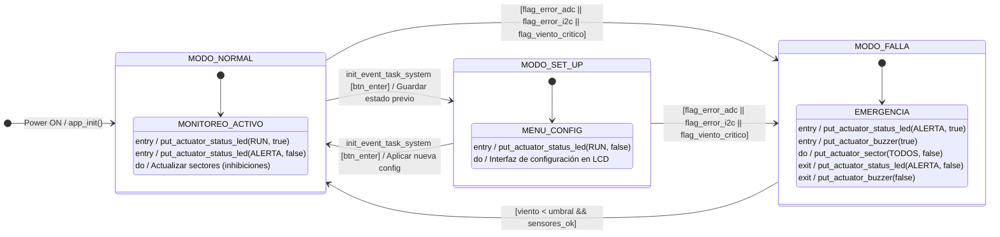

# **Sistema de Riego Automático con Gestión de Viento (SRAGV) - INFORME FINAL**

**Autores:** Garcia Caneva Leandro, Vargas Joaquin, Molina Aban Florencia  
**Padrones:** 103476, 104323, 104153  
**Fecha:** 1er cuatrimestre 2026

---

# Índice General

- [Capítulo 1: Introducción general](#capítulo-1-introducción-general)
  - [1.1 Análisis de necesidad y objetivo](#11-análisis-de-necesidad-y-objetivo)
  - [1.2 Productos comparables](#12-productos-comparables)
  - [1.3 Productos comerciales disponibles](#13-productos-comerciales-disponibles)
  - [1.4 Comparación con el prototipo desarrollado y alcance](#14-comparación-con-el-prototipo-desarrollado-y-alcance)
- [Capítulo 2: Introducción específica](#capítulo-2-introducción-específica)
  - [2.1 Requisitos del sistema y detalle de cambios](#21-requisitos-del-sistema-y-detalle-de-cambios)
  - [2.2 Casos de uso y operación](#22-casos-de-uso-y-operación)
- [Capítulo 3: Diseño e implementación](#capítulo-3-diseño-e-implementación)
  - [3.1 Arquitectura de Hardware](#31-arquitectura-de-hardware)
  - [3.2 Diseño de Firmware (Máquinas de Estado)](#32-diseño-de-firmware-máquinas-de-estado)
  - [3.3 Esquema Eléctrico y Vistas de Cableado](#33-esquema-eléctrico-y-vistas-de-cableado)
  - [3.5 Aplicación Web](#35-aplicación-web)
- [Capítulo 4: Ensayos y resultados](#capítulo-4-ensayos-y-resultados)
  - [4.1 Pruebas de integración Hardware-Software](#41-pruebas-de-integración-hardware-software)
  - [4.2 Pruebas de campo simuladas](#42-pruebas-de-campo-simuladas)
- [Capítulo 5: Conclusiones](#capítulo-5-conclusiones)
- [Capítulo 6: Uso de herramientas de IA](#capítulo-6-uso-de-herramientas-de-ia)
- [Capítulo 7: Bibliografía y referencias](#capítulo-7-bibliografía-y-referencias)

---

## Capítulo 1: Introducción general

### 1.1 Análisis de necesidad y objetivo
El objetivo de este proyecto es desarrollar un sistema de riego automático inteligente gestionado por viento. Si bien el riego automatizado es fundamental para optimizar el uso del agua y garantizar una cobertura uniforme, factores climáticos extremos pueden alterar drásticamente su eficacia. Esta problemática cobra especial relevancia en regiones como la Patagonia argentina, donde la presencia de vientos fuertes y sostenidos —con ráfagas que superan frecuentemente los 80 km/h— es una constante del día a día, desviando el agua de su objetivo y generando desperdicio. Además, si el agua choca constantemente contra una estructura (como una calzada, un galpón o una pared), puede deteriorarla gravemente con el tiempo.

El sistema SRAGV (Sistema de Riego Automático Gestionado por Viento) resuelve este problema inhibiendo sectores específicos de riego en función de la velocidad y dirección del viento. 
Cabe destacar que para el desarrollo de este prototipo, **el viento se emuló utilizando exclusivamente un joystick analógico**, el cual simula tanto la velocidad (mediante la desviación desde el centro) como la dirección (mediante el eje dominante). 

El sistema cuenta con un **Modo Normal** que puede operar bajo dos lógicas distintas de inhibición:
1. **Inhibición inversa (Contrasector):** Si hay viento en una dirección, se apaga el sector contrario. Por ejemplo, si hay viento Sur, se apaga el sector Norte para compensar el arrastre del agua.
2. **Inhibición directa:** Si hay viento Sur, se apaga el sector Sur. Esta opción está pensada específicamente por si hay alguna construcción u objeto cercano a ese sector que no se desea mojar y se quiere evitar que el viento empuje el agua hacia allí.

### 1.2 Productos comparables
Existen en el mercado soluciones de riego automatizado muy populares. Un claro ejemplo que se encuentra disponible en Mercado Libre es el **Programador de Riego Rainbird ESP-Rzxe (6 Zonas Wifi)**. 

Si bien este es un equipo robusto y comercialmente exitoso, carece de una característica clave de nuestro diseño: **no cuenta con un sistema que apague sectores específicos por dirección de viento**. Algunos programadores comerciales pueden conectarse a estaciones meteorológicas para dejar de regar completamente en caso de tormentas, pero no tienen la granularidad de apagar selectivamente zonas individuales basándose en la dinámica vectorial del viento en tiempo real. 
Cabe mencionar que, en esta etapa del producto, decidimos enfocarnos completamente en la corrección por viento y no agregamos un sensor de humedad de suelo, el cual suele estar presente en otras soluciones.

### 1.3 Productos comerciales disponibles
El referente comercial principal para comparar este desarrollo es la familia de controladores de la empresa [Rain Bird | A Global Irrigation Company](https://www.rainbird.com/es), específicamente el modelo **Rainbird ESP-Rzxe**. Estos sistemas controlan electroválvulas mediante salidas de 24VAC y permiten programación por días y zonas.

### 1.4 Comparación con el prototipo desarrollado y alcance
A diferencia del Rainbird ESP-Rzxe, nuestro prototipo incorpora lógica ambiental directa en la toma de decisiones por sector, y no solo un temporizador.

---

## Capítulo 2: Introducción específica

### 2.1 Requisitos del sistema y detalle de cambios
Durante la realización del trabajo se produjeron cambios en los requisitos originales por motivos de viabilidad técnica y tiempo:
- **Sensor de Viento:** En lugar de construir un anemómetro físico y una veleta, se decidió utilizar un **Joystick Analógico** conectado al ADC del microcontrolador para emular las variables climáticas.
- **Sensor de Humedad:** Se descartó en esta versión iterativa para enfocar el esfuerzo en la máquina de estados del viento y la telemetría.

### 2.2 Casos de uso y operación
- Configuración de umbrales: El usuario ajusta los umbrales de Viento Moderado y Crítico desde la pantalla LCD.
- Riego Automático: El sistema alterna entre tiempos de riego y de descanso en base a la configuración guardada.
- Inhibición Manual: Mediante un módulo de DIP Switches, el usuario puede apagar cualquier sector a voluntad.
- Modo Falla: Si el viento supera el umbral crítico, se suspende todo riego de forma preventiva y se activa una alarma (LED de alerta y Buzzer).

---

## Capítulo 3: Diseño e implementación

### 3.1 Arquitectura de Hardware
El sistema fue implementado sobre una placa **STM32 Nucleo-F103RB**.
A continuación, se presentan imágenes del circuito probado, tanto en etapa de protoboard como su ensamble final soldado en placa perforada:

  
   
  <em>Figura 1: Prototipo inicial interconectado en protoboard.</em>

  
   
  <em>Figura 2: Vista superior del circuito soldado en placa perforada.</em>

 
  

   
  <em>Figura 3: Vista inferior del circuito soldado (ruteo manual con estaño).</em>

### 3.2 Diseño de Firmware (Máquinas de Estado)
El firmware se estructuró mediante una arquitectura **Super-loop (Bare-metal)** orientada a eventos. 
El flujo principal recae sobre `task_system.c`, que implementa la Máquina de Estados principal:

<em>Figura 3.4: Diagrama de estados (Statechart) del SRAGV — FSM principal</em>

1. **MODO_INIT:** Inicialización del hardware periférico y lectura de la memoria EEPROM.
2. **MODO_NORMAL:** Evaluación constante de la lógica de riego y monitoreo del ADC (Joystick). Dependiendo de si la velocidad de viento es moderada, se decide inhibir un sector (según Modo Directo o Inverso).
3. **MODO_SETUP:** Menú interactivo a través del display LCD, navegable con pulsadores con anti-rebote por software.
4. **MODO_FALLA:** Disparado por viento crítico o falla grave del ADC. Cierra todas las válvulas y levanta alarmas visuales/sonoras.

### 3.3 Esquema Eléctrico y Vistas de Cableado
Para documentar las conexiones físicas entre los componentes, se elaboró un diagrama de conexionado utilizando la herramienta Fritzing. Si bien este formato de "vista de protoboard" (layout) difiere de un diagrama esquemático simbólico tradicional, ilustra de manera clara, didáctica y directa cómo se vinculan los pines reales del microcontrolador STM32 Nucleo con los módulos periféricos (pantalla LCD I2C, módulo Bluetooth HC-05, joystick analógico, matriz de LEDs de sectores y el panel de DIP switches).

   
  <em>Figura 3.5: Diagrama de cableado.</em>

> [!NOTE]
> **Aclaración sobre la representación visual:** Los componentes mostrados en la Figura 3.5 (específicamente los valores de las resistencias, colores de ciertos encapsulados y modelos exactos de módulos) constituyen una representación visual para ilustrar el esquema de interconexión (pines y cableado). Algunos valores y componentes puntuales pueden diferir ligeramente de los utilizados en el ensamble de la placa física real documentada en las Figuras 1, 2 y 3.

### 3.5 Aplicación Web
Como complemento a la interfaz física (LCD y botones), se desarrolló una **Web App** interactiva. El usuario puede conectarse a la placa a través de Bluetooth directamente desde su navegador web para disponer de un panel de control y monitoreo en tiempo real. La aplicación se encuentra alojada y disponible para su uso en el siguiente enlace: **[SRAGV - Monitoreo Bluetooth](https://leangc13.github.io/SRAGV-APP/)**.

Desde esta interfaz, el usuario puede:
- Visualizar el **estado actual del sistema** (ej. Normal, Falla).
- Ver un tablero gráfico con la **velocidad (%) y dirección del viento** y el nivel de luz ambiente.
- Monitorear gráficamente cuáles **sectores de riego** están encendidos o inhibidos.
- Ajustar remotamente todos los **parámetros de control**: umbrales de viento moderado y crítico, duración de un ciclo de riego, activación del riego nocturno, selección de la lógica de inhibición de viento (Modo Opuesto / Directo), y la inhibición manual de zonas específicas.

 

   
  <em>Figura 3.6: Panel principal de la Web App mostrando monitoreo y ajustes.</em>

  
   
  <em>Figura 3.7: Vista de lecturas de viento en tiempo real y estado del sistema.</em>

---

## Capítulo 4: Ensayos y resultados

### 4.1 Pruebas de integración Hardware-Software
- **Emulación con Joystick:** Se verificó exitosamente que las coordenadas `VRX` y `VRY` del joystick se traducen matemáticamente a un vector de magnitud y ángulo, permitiendo probar las 4 direcciones (N, S, E, W) y velocidades del 0 al 100%.
- **DIP Switches:** Se solucionaron problemas iniciales de pines "flotantes" configurando resistencias Pull-Up internas (`GPIO_PULLUP`), permitiendo inhibir sectores individualmente de forma estable.
- **LEDs indicadores:** Se usó lógica *Active High* (Ánodo a pin, Cátodo a GND) para reflejar fielmente las salidas digitales del microcontrolador.

### 4.2 Pruebas de campo simuladas
Se validó la transición entre estados. Al someter el sistema (moviendo el joystick al extremo) a condiciones superiores al umbral configurado (viento crítico), la pantalla LCD reacciona inmediatamente reflejando `SYSTEM FAULT!` y el LED de alerta parpadea a 1Hz, cumpliendo con la especificación de seguridad del producto.

---

## Capítulo 5: Conclusiones
El proyecto SRAGV demuestra la viabilidad de utilizar variables climáticas, particularmente el viento, para realizar ajustes granulares en sistemas de irrigación. La adición de dos lógicas diferentes (Inhibición Inversa y Directa) le otorga una flexibilidad arquitectónica superior a las alternativas comerciales simples, previniendo daños estructurales en edificios colindantes y optimizando el agua. El desarrollo permitió consolidar conocimientos sobre sistemas embebidos mediante el uso de ADC por DMA, comunicación I2C (EEPROM y LCD), UART (Bluetooth), anti-rebotes y máquinas de estado no bloqueantes.

---
---

## Capítulo 7: Bibliografía y referencias
- STMicroelectronics. (s.f.). *Reference manual STM32F103RB*.
- *A Beginner’s Guide to Designing Embedded System Applications on Arm Cortex-M Microcontroller*.
- [Rain Bird | A Global Irrigation Company](https://www.rainbird.com/es)
- [STM32 Nucleo-64 boards (MB1136) - User manual](https://www.st.com/resource/en/user_manual/um1724-stm32-nucleo64-boards-mb1136-stmicroelectronics.pdf)
- [New Output](https://www.st.com/resource/en/schematic_pack/mb1136-default-c04_schematic.pdf)
